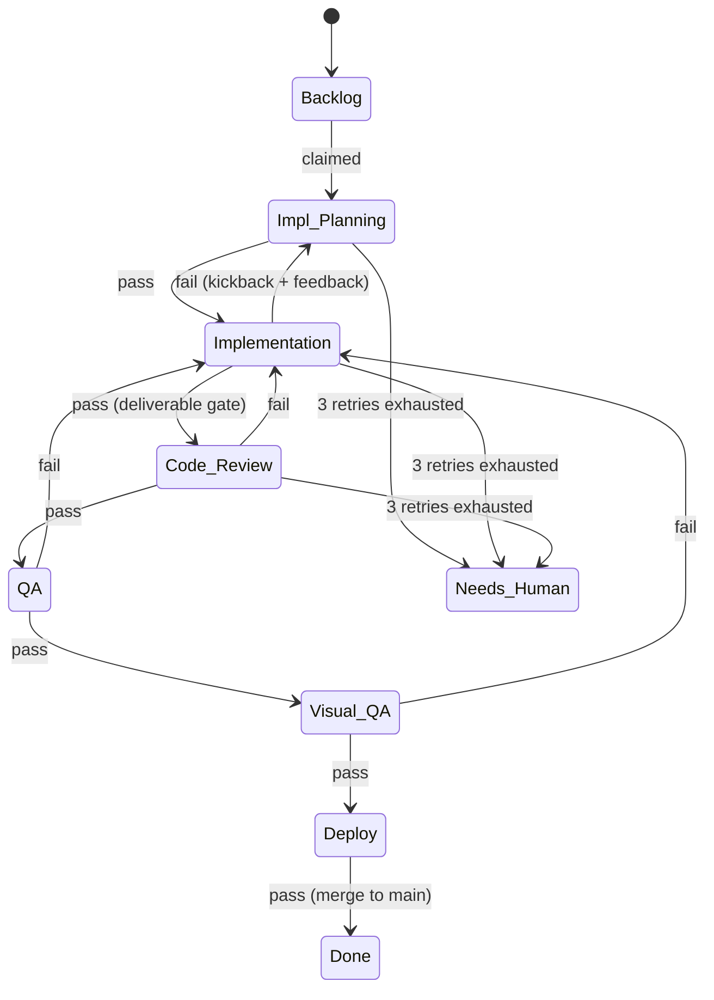

# clockwork

A kanban board where the columns are a state machine and the worker is an AI agent.

Cards flow left to right through prompt-defined columns. A single worker loop
claims the next card, assembles a fresh context window, runs a
[pi](https://github.com/earendil-works/pi) coding session against a local model,
parses a structured verdict from the output, and moves the card forward (or kicks
it back with feedback). Humans watch a live web board. A director agent (Opus-class)
plans and steers through the API at periodic check-ins.

The machinery is deliberately dumb. Intelligence lives in column prompts (editable
data), written plans, and adversarial verifier stages — not in agent-to-agent
reasoning. This is the lesson from every multi-agent system that compounds errors
the more agents talk to each other.

It shipped [prism-drift](https://github.com/rosschambers/prism-drift) milestone 1
autonomously — cards flowed through implementation, code review, QA, and visual QA
without human intervention.

## How cards move



Every session ends with a JSON verdict: `{"verdict": "pass"|"fail"|"blocked", "feedback": "...", "artifacts": [...]}`. Malformed output = blocked (safe default). Workers never self-certify — separate verifier columns gate every advance.

## Features

- **Columns are data, not code.** Each column has a prompt, a model, and skills. The director edits them live through the API. Add a stage by inserting a row.
- **Per-card git isolation.** Each card gets a branch. Work is committed per-attempt. On Done, the branch merges to main automatically.
- **Deliverable gate.** Cards declare target files; the gate blocks advancement unless the branch diff actually touches them. No more "implemented" cards that only wrote a plan.
- **Dependency ordering.** `depends_on` chains cards so the scheduler will not claim a card until its prerequisite reaches Done.
- **Visual QA.** A GPU render harness captures screenshots from a running game, sends them to a vision model, and emits a pass/fail verdict. Used for Godot projects.
- **Kickback with bounded retry.** Failures bounce a card back one column with the verifier's feedback attached. After 3 retries the card parks at needs-human and fires an SMS.
- **Live web board.** Real-time updates over websockets. Manual card moves supported — a human is a valid mover.
- **SMS notifications.** Webhooks fire on needs-human, retry exhaustion, and milestone completion.
- **Tiered context assembly.** Sessions are short and assembled fresh — project docs, plan slice, card thread (oldest-truncated), column skills — all within the model's effective context window.

## Tech stack

Bun, TypeScript, SQLite (WAL mode), websockets. No framework — the HTTP server and
websocket layer are built on Bun's native APIs. The worker spawns `pi` sessions
against any OpenAI-compatible model endpoint (local llama-server, Ollama, vLLM, or
hosted).

## Tests

322 tests. 780 assertions. 1.5:1 test-to-source line ratio (7,134 test lines / 4,651 source lines). Built strictly test-first.

```
$ bun run check
$ tsc --noEmit && bun test

 322 pass
 0 fail
 780 expect() calls
Ran 322 tests across 15 files. [14.15s]
```

## Getting started

```bash
bun install
cp .env.example .env              # set CLOCKWORK_TOKEN at minimum
bun run src/index.ts              # board + API on http://localhost:3000
```

Create a project through the API (or `scripts/bootstrap-project.ts`), set
`CLOCKWORK_WORKER_PROJECT_ID=<project-id>` in the environment, and restart.
The same process runs the worker loop, claiming cards and running pi sessions.

Requires Bun, the [pi](https://github.com/earendil-works/pi) agent runtime,
and any OpenAI-compatible model endpoint (`docker/pi-models.json` has the config shape).
Built for a homelab but runs anywhere Bun + pi + a model endpoint exist.

## Documentation

- [Design document](docs/plans/2026-08-17-clockwork-design.md) — 19 locked decisions
- [Implementation plan](docs/plans/2026-08-17-clockwork-implementation-plan.md)
- [Implementation reference](docs/impl-ref.md) — current code shape
- [New tenant runbook](docs/new-tenant-runbook.md)

## License

[MIT](LICENSE)
