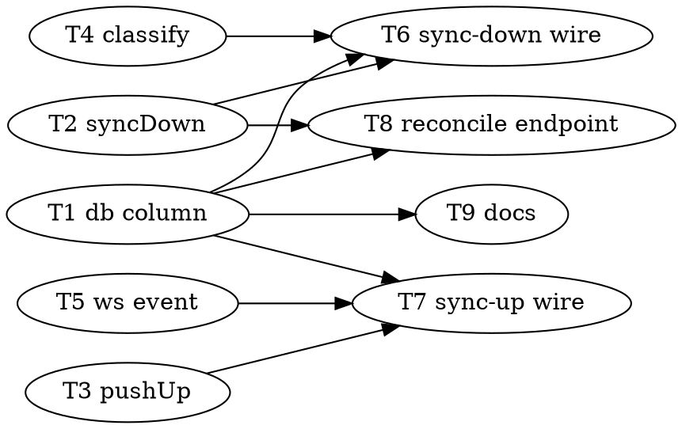

# Bidirectional GitHub Sync for the Pipeline Origin — Implementation Plan

> **For OpenCode:** REQUIRED SUB-SKILL: Use superpowers:executing-plans to implement this plan task-by-task.

**Goal:** Keep each project's pipeline `file://` origin and its GitHub upstream in sync in both
directions, event-driven and fail-closed, so an unattended pipeline never silently auto-merges
product code and any divergence becomes a classified director decision.

**Architecture:** A new nullable per-project column `github_upstream` names the GitHub remote of
the pipeline repo. Two deterministic git operations live on `RepoWorkspace`
(`syncDownFromUpstream`, `pushUpToUpstream`); both no-op when the upstream is null. The **worker
orchestrates** — it calls sync-down before running a card (routing a divergence to the
Needs-Director column instead of running pi) and calls sync-up after a successful merge to main
(recording a non-blocking flag on rejection). A director endpoint `POST
/api/projects/:id/sync/reconcile` performs the one real merge + dual-push, returning the conflict
file list on conflict without auto-resolving. `repo.ts` stays pure git plumbing; the worker owns
all thread/SMS/routing side effects.

**Tech Stack:** Bun + TypeScript (ES modules, `function` declarations top-level, explicit return
types on exports, no nested ternaries, **tabs**), SQLite (WAL) via `bun:sqlite`, `Bun.spawn` for
git, `bun:test`. The gate is `bun run check` (`tsc --noEmit` + `bun test`), run before **every**
commit.

**Assumptions:**

- The design at `docs/plans/2026-08-21-github-sync-design.md` is approved and implemented exactly;
  acceptance criteria 1-7 there are the definition of done (mapped at the end of this plan).
- SQLite migrations are **additive only** — mirror the existing `depends_on`/`targets`/`scenario`
  pattern: column in the `CREATE TABLE` **and** an `ALTER TABLE ADD COLUMN` in a try/catch.
  Migrations run in `initialize()` (called by `index.ts:29`), not the constructor.
- `CLOCKWORK_GIT_TOKEN` is valid for GitHub push and is **currently empty on studio** — sync-up
  needs it set (Task 9 documents this). Sync-down from a public repo works without a token.
- Single worker: no concurrent sync races. The pipeline repo keeps GitHub reachable as its
  `github_upstream` value. Only the existing `defaultBranch` is handled (no multi-branch).
- **Seam decision (Tasks 6 and 7): the worker orchestrates; `repo.ts` stays pure git.**
  Justification: `repo.ts` already knows nothing about card threads, park columns, SMS, or ws
  events (see `mergeCardToMain`/`prepareCardWorkspace` — pure git). Routing a divergence to
  Needs-Director, writing a `sync-diverged` thread entry, classifying a park reason, emitting
  `card.parked`, and firing SMS are all worker concerns and all already live in the worker
  (`kickback`'s needs-human path). Putting sync side effects in `repo.ts` would drag the DB,
  classifier, notify layer, and ws broker into what is currently a git-only module and break the
  "machinery stays dumb" rule. So the two `RepoWorkspace` methods return plain result objects and
  the worker decides what to do with them.

**Topology (from the design):**

```
workspace clone  <--origin-->  pipeline file:// repo  <--github_upstream-->  GitHub
 (card/<id> branch)            ($CLOCKWORK_REPOS/<project>)                  (rosschambers/<repo>)
```

The **pipeline repo** is `${projectRoot}/${projectId}` — the same path `prepareCardWorkspace`
clones into and the same path the worker passes to `mergeCardToMain` (`worker.ts:736`). Its
`origin` is the `file://` pipeline repo the workspace was cloned from; its **`github_upstream`**
is the separate GitHub remote. Sync-down fast-forwards this pipeline repo from GitHub **before**
the workspace clone pulls fresh code from it; sync-up pushes this pipeline repo's default branch
**up** to GitHub after the local merge already succeeded.

**Task-ordering note:** Tasks are dependency-ordered. Tasks 1, 4, 5 touch disjoint files and are
parallelizable with each other. Task 2 and Task 3 both edit `repo.ts`/`repo.test.ts` (serialize
them, or do both in one branch). Tasks 6, 7, 8 depend on 1-5 and on each other's understanding of
the worker/api seams; do them in order. Task 9 is docs-only and can run any time after Task 1.

---

## Task 1: Additive `github_upstream` column on projects

**Files:**
- Modify: `src/db.ts` — `DbProject` (add `githubUpstream`), `CreateProjectInput`,
  `UpdateProjectInput`, `createProject`, `updateProject`, `parseProjectRow`, `getProjectById`
  inline mapper, the `CREATE TABLE projects` DDL, and a new `ALTER TABLE` migration.
- Test: `src/db.test.ts`

**Acceptance Criteria:**
- [ ] `DbProject` gains `githubUpstream: string | null`.
- [ ] `CreateProjectInput` gains `githubUpstream: string | null`; `UpdateProjectInput` gains
      `githubUpstream?: string | null`.
- [ ] `projects` `CREATE TABLE` includes `github_upstream TEXT` (nullable).
- [ ] A new `ALTER TABLE projects ADD COLUMN github_upstream TEXT` sits in its own try/catch,
      mirroring the three `cards` ALTER TABLEs at `db.ts:203-219`.
- [ ] `createProject` inserts `github_upstream`; `updateProject` sets it when provided;
      `parseProjectRow` **and** the inline mapper in `getProjectById` read `row.github_upstream`
      into `githubUpstream`.
- [ ] A create-then-read round-trip returns the stored `githubUpstream`; an unset project reads
      `githubUpstream === null`; `updateProject` mutates it.
- [ ] `bun run check` is green. No changes to files outside the list above.

**Step 1: Write the failing test**

Add to `src/db.test.ts`, inside `describe("DbStore — projects", ...)`:

```typescript
it("round-trips github_upstream (defaults null)", () => {
	const created = store.createProject({
		name: "Sync Project",
		description: "",
		githubRepo: "file:///tmp/pipeline",
		branch: null,
		githubUpstream: "https://github.com/rosschambers/repo.git",
	})
	expect(created.githubUpstream).toBe("https://github.com/rosschambers/repo.git")

	const read = store.getProjectById(created.id)
	expect(read!.githubUpstream).toBe("https://github.com/rosschambers/repo.git")

	const bare = store.createProject({
		name: "Local Only",
		description: "",
		githubRepo: null,
		branch: null,
		githubUpstream: null,
	})
	expect(bare.githubUpstream).toBeNull()

	const updated = store.updateProject(bare.id, {
		githubUpstream: "https://github.com/rosschambers/other.git",
	})
	expect(updated.githubUpstream).toBe("https://github.com/rosschambers/other.git")
})
```

**Note:** every existing `createProject(...)` call in the test suites omits `githubUpstream`. Make
the interface field `githubUpstream: string | null` and have `createProject` coalesce
`input.githubUpstream ?? null`, so **existing call sites still compile** without edits (they pass
an object literal without the key → `undefined` → coalesced to null). Verify with `tsc` in Step 2;
if TypeScript rejects the missing key, make the `CreateProjectInput` field optional
(`githubUpstream?: string | null`) instead — check which the codebase already tolerates for
`branch` (it is required there, but every caller passes it, so prefer **optional** here to avoid
touching every seed helper).

**Step 2: Run test — verify it fails**

Run: `bun test src/db.test.ts`
Expected: FAIL — `githubUpstream` is `undefined` / property does not exist.

**Step 3: Minimal implementation**

In `src/db.ts`:

- `DbProject` — add after `branch`: `githubUpstream: string | null`.
- `CreateProjectInput` — add `githubUpstream?: string | null`.
- `UpdateProjectInput` — add `githubUpstream?: string | null`.
- `CREATE TABLE projects` — add `github_upstream TEXT` after the `branch TEXT` line.
- After the `cards` ALTER TABLE block (`db.ts:219`), add:

```typescript
		try {
			this.run("ALTER TABLE projects ADD COLUMN github_upstream TEXT")
		} catch {
			// Column already exists — nothing to do.
		}
```

- `createProject` — add `github_upstream` to the column list and one more `?`; bind
  `input.githubUpstream ?? null`:

```typescript
		this.run(`
			INSERT INTO projects (id, name, description, github_repo, branch, github_upstream)
			VALUES (?, ?, ?, ?, ?, ?)
		`, id, input.name, input.description, input.githubRepo ?? null, input.branch ?? null, input.githubUpstream ?? null)
```

- `updateProject` — add a clause:

```typescript
		if (input.githubUpstream !== undefined) {
			updates.push("github_upstream = ?")
			params.push(input.githubUpstream ?? null)
		}
```

- `parseProjectRow` **and** the inline object in `getProjectById` — add
  `githubUpstream: row.github_upstream,`.

**Step 4: Run test — verify it passes**

Run: `bun run check`
Expected: PASS (tsc clean + all tests green).

**Step 5: Commit**

```bash
git add src/db.ts src/db.test.ts
git commit -m "feat: add additive github_upstream column on projects"
```

---

## Task 2: `RepoWorkspace.syncDownFromUpstream`

**Files:**
- Modify: `src/repo.ts` — add `syncDownFromUpstream` and a small `revListCount` helper.
- Test: `src/repo.test.ts`

**Method signature (exported behavior — explicit return type):**

```typescript
async syncDownFromUpstream(
	pipelineRepoPath: string,
	upstreamUrl: string,
	branch: string,
): Promise<{ ok: boolean; action: "ff" | "noop" | "diverged" | "error"; ahead: number; behind: number }>
```

**Semantics (design §A):**
1. `git -C <repo> fetch <upstreamUrl> <branch>` into `FETCH_HEAD`.
2. Compute ahead/behind of the local branch vs the fetched head using
   `git rev-list --left-right --count <branch>...FETCH_HEAD` → `"<ahead>\t<behind>"`. `ahead` =
   commits local has that upstream lacks (left); `behind` = commits upstream has that local lacks
   (right).
3. `behind === 0 && ahead === 0` → `{ ok: true, action: "noop", ahead: 0, behind: 0 }` (equal).
4. `ahead === 0 && behind > 0` → `git -C <repo> merge --ff-only FETCH_HEAD` → on success
   `{ ok: true, action: "ff", ahead, behind }`.
5. `ahead > 0 && behind > 0` → **diverged**: do NOT merge, leave the repo byte-for-byte
   unchanged, return `{ ok: false, action: "diverged", ahead, behind }`.
6. Any git error (fetch fails, ff-only rejects unexpectedly) → **fail-closed**:
   `{ ok: false, action: "error", ahead: 0, behind: 0 }` — never throw the pipeline down.
   `ahead > 0 && behind === 0` (local strictly ahead) is safe → treat as `noop` (nothing to pull;
   Task 3's push will carry local up).

**Reuse:** the `Bun.spawn` + `new Response(proc.stdout).text()` capture pattern from
`computeChangedFiles`/`branchExists` for `rev-list`. Do the fetch/merge through a **non-throwing**
variant — either wrap `this.run` in try/catch (which throws on non-zero) and map to the `error`
result, or add a private `runCapture(args): Promise<{ code: number; stdout: string; stderr: string }>`
and branch on `code`. Prefer `runCapture` so ahead/behind and error handling share one helper.

**Acceptance Criteria:**
- [ ] Signature matches exactly (explicit return type, tabs).
- [ ] Upstream ahead (local behind only) → `action: "ff"`, `ok: true`, and the pipeline repo's
      working tree now contains the upstream commit.
- [ ] Equal → `action: "noop"`, `ok: true`, repo unchanged.
- [ ] Diverged (both ahead and behind) → `action: "diverged"`, `ok: false`, repo HEAD unchanged
      (assert the pre-sync HEAD SHA equals the post-sync HEAD SHA).
- [ ] Never force-merges; never throws (a bad `upstreamUrl` returns `action: "error"`).
- [ ] `bun run check` green. No changes outside the file list.

**Step 1: Write the failing tests** (`src/repo.test.ts`, new `describe("syncDownFromUpstream", ...)`)

Divergence is simulated by giving the pipeline clone a SECOND remote (the "upstream") and
committing to each side independently so neither is an ancestor of the other. Add a seed helper
beside `seedRemote` that creates an upstream bare repo plus a pipeline clone of it:

```typescript
function seedUpstreamAndPipeline(projectRoot: string): { upstreamPath: string; pipelinePath: string } {
	const upstreamPath = `${projectRoot}/upstream-bare.git`
	fs.mkdirSync(upstreamPath)
	const seedWork = `${projectRoot}/upstream-seed`
	fs.mkdirSync(seedWork)
	const run = (args: string[], cwd: string): void => {
		const p = Bun.spawnSync(["git", ...args], { cwd })
		if (p.exitCode !== 0) {
			throw new Error(`git ${args.join(" ")}: ${new TextDecoder().decode(p.stderr ?? new Uint8Array()).trim()}`)
		}
	}
	run(["init", "--bare"], upstreamPath)
	run(["init"], seedWork)
	run(["config", "user.name", "test"], seedWork)
	run(["config", "user.email", "test@test"], seedWork)
	run(["remote", "add", "origin", upstreamPath], seedWork)
	fs.writeFileSync(`${seedWork}/README.md`, "# Upstream")
	run(["add", "."], seedWork)
	run(["commit", "-m", "initial"], seedWork)
	run(["push", "-u", "origin", "main"], seedWork)
	cleanup(seedWork)

	// The pipeline repo is a plain clone of the upstream — upstream is reachable as
	// file://<upstreamPath>. Its own default branch tracks upstream/main at seed time.
	const pipelinePath = `${projectRoot}/pipeline`
	const clone = Bun.spawnSync(["git", "clone", `file://${upstreamPath}`, pipelinePath], {})
	if (clone.exitCode !== 0) {
		throw new Error("clone failed")
	}
	Bun.spawnSync(["git", "-C", pipelinePath, "config", "user.name", "clockwork"], {})
	Bun.spawnSync(["git", "-C", pipelinePath, "config", "user.email", "clockwork@local"], {})
	return { upstreamPath, pipelinePath }
}

function commitFile(repoOrBareWorkPath: string, name: string, content: string): void {
	fs.writeFileSync(`${repoOrBareWorkPath}/${name}`, content)
	Bun.spawnSync(["git", "-C", repoOrBareWorkPath, "add", "."], {})
	Bun.spawnSync(["git", "-C", repoOrBareWorkPath, "commit", "-m", `add ${name}`], {})
}

function headSha(repoPath: string): string {
	const p = Bun.spawnSync(["git", "-C", repoPath, "rev-parse", "HEAD"], {})
	return new TextDecoder().decode(p.stdout ?? new Uint8Array()).trim()
}

// Advance the UPSTREAM bare repo by pushing a new commit from a throwaway clone.
function advanceUpstream(projectRoot: string, upstreamPath: string, name: string, content: string): void {
	const work = `${projectRoot}/upstream-advance-${name}`
	Bun.spawnSync(["git", "clone", `file://${upstreamPath}`, work], {})
	commitFile(work, name, content)
	Bun.spawnSync(["git", "-C", work, "push", "origin", "main"], {})
	cleanup(work)
}
```

Tests:

```typescript
describe("syncDownFromUpstream", () => {
	it("upstream ahead -> fast-forwards the pipeline repo", async () => {
		const { upstreamPath, pipelinePath } = seedUpstreamAndPipeline(projectRoot)
		const ws = new RepoWorkspace({ projectRoot, gitToken: "fake", defaultBranch: "main" }, store)

		advanceUpstream(projectRoot, upstreamPath, "upstream-feature.txt", "from github")

		const result = await ws.syncDownFromUpstream(pipelinePath, `file://${upstreamPath}`, "main")
		expect(result.action).toBe("ff")
		expect(result.ok).toBe(true)
		expect(fs.existsSync(`${pipelinePath}/upstream-feature.txt`)).toBe(true)
	})

	it("equal -> noop, repo unchanged", async () => {
		const { upstreamPath, pipelinePath } = seedUpstreamAndPipeline(projectRoot)
		const ws = new RepoWorkspace({ projectRoot, gitToken: "fake", defaultBranch: "main" }, store)
		const before = headSha(pipelinePath)

		const result = await ws.syncDownFromUpstream(pipelinePath, `file://${upstreamPath}`, "main")
		expect(result.action).toBe("noop")
		expect(headSha(pipelinePath)).toBe(before)
	})

	it("diverged -> returns diverged and leaves the repo byte-for-byte unchanged", async () => {
		const { upstreamPath, pipelinePath } = seedUpstreamAndPipeline(projectRoot)
		const ws = new RepoWorkspace({ projectRoot, gitToken: "fake", defaultBranch: "main" }, store)

		// Local commit only on the pipeline repo (ahead).
		commitFile(pipelinePath, "local-only.txt", "pipeline work")
		// Upstream commit only on github (behind) -> now both ahead and behind.
		advanceUpstream(projectRoot, upstreamPath, "github-only.txt", "github work")

		const before = headSha(pipelinePath)
		const result = await ws.syncDownFromUpstream(pipelinePath, `file://${upstreamPath}`, "main")
		expect(result.action).toBe("diverged")
		expect(result.ok).toBe(false)
		expect(result.ahead).toBeGreaterThan(0)
		expect(result.behind).toBeGreaterThan(0)
		expect(headSha(pipelinePath)).toBe(before)
		expect(fs.existsSync(`${pipelinePath}/github-only.txt`)).toBe(false)
	})

	it("bad upstream url -> fail-closed error, never throws", async () => {
		const { pipelinePath } = seedUpstreamAndPipeline(projectRoot)
		const ws = new RepoWorkspace({ projectRoot, gitToken: "fake", defaultBranch: "main" }, store)
		const result = await ws.syncDownFromUpstream(pipelinePath, "file:///nonexistent/nope.git", "main")
		expect(result.action).toBe("error")
		expect(result.ok).toBe(false)
	})
})
```

**Step 2: Run — verify it fails**

Run: `bun test src/repo.test.ts`
Expected: FAIL — `syncDownFromUpstream` is not a function.

**Step 3: Minimal implementation** (in `src/repo.ts`)

Add a non-throwing capture helper and the method:

```typescript
	private async runCapture(args: string[]): Promise<{ code: number; stdout: string; stderr: string }> {
		const proc = Bun.spawn(["git", ...args], { stdout: "pipe", stderr: "pipe" })
		const stdout = proc.stdout ? await new Response(proc.stdout).text() : ""
		const stderr = proc.stderr ? await new Response(proc.stderr).text() : ""
		const code = await proc.exited
		return { code, stdout, stderr }
	}

	async syncDownFromUpstream(
		pipelineRepoPath: string,
		upstreamUrl: string,
		branch: string,
	): Promise<{ ok: boolean; action: "ff" | "noop" | "diverged" | "error"; ahead: number; behind: number }> {
		const fetched = await this.runCapture(["-C", pipelineRepoPath, "fetch", upstreamUrl, branch])
		if (fetched.code !== 0) {
			return { ok: false, action: "error", ahead: 0, behind: 0 }
		}
		const counts = await this.runCapture(["-C", pipelineRepoPath, "rev-list", "--left-right", "--count", `${branch}...FETCH_HEAD`])
		if (counts.code !== 0) {
			return { ok: false, action: "error", ahead: 0, behind: 0 }
		}
		const parts = counts.stdout.trim().split(/\s+/)
		const ahead = Number(parts[0] ?? "0")
		const behind = Number(parts[1] ?? "0")
		if (behind === 0) {
			// Equal or local strictly ahead: nothing to pull down. Push (Task 3) carries local up.
			return { ok: true, action: "noop", ahead, behind }
		}
		if (ahead > 0) {
			// Both ahead and behind — real divergence. Do NOT merge; leave repo untouched.
			return { ok: false, action: "diverged", ahead, behind }
		}
		const merged = await this.runCapture(["-C", pipelineRepoPath, "merge", "--ff-only", "FETCH_HEAD"])
		if (merged.code !== 0) {
			return { ok: false, action: "error", ahead, behind }
		}
		return { ok: true, action: "ff", ahead, behind }
	}
```

**Step 4: Run — verify it passes**

Run: `bun run check`
Expected: PASS.

**Step 5: Commit**

```bash
git add src/repo.ts src/repo.test.ts
git commit -m "feat: RepoWorkspace.syncDownFromUpstream (ff-or-diverged, fail-closed)"
```

---

## Task 3: `RepoWorkspace.pushUpToUpstream`

**Files:**
- Modify: `src/repo.ts` — add `pushUpToUpstream` (reuse `runCapture` from Task 2).
- Test: `src/repo.test.ts`

**Method signature:**

```typescript
async pushUpToUpstream(
	pipelineRepoPath: string,
	upstreamUrl: string,
	branch: string,
): Promise<{ ok: boolean; rejected: boolean }>
```

**Semantics (design §B):**
1. `git -C <repo> push <upstreamUrl> <branch>`.
2. Exit 0 → `{ ok: true, rejected: false }`.
3. Non-zero **and** stderr indicates a non-fast-forward rejection (`/rejected/i` or
   `/non-fast-forward/i` or `/fetch first/i`) → `{ ok: false, rejected: true }`.
4. Any other non-zero → `{ ok: false, rejected: false }` (a real error, still non-blocking upstream).
5. **Never** `--force` / `--force-with-lease`.

**Acceptance Criteria:**
- [ ] Signature matches exactly.
- [ ] Clean fast-forward push → `{ ok: true, rejected: false }` and the upstream bare repo's
      `main` now contains the pushed commit.
- [ ] Upstream moved ahead (non-fast-forward) → `{ ok: false, rejected: true }`; the upstream is
      NOT rewritten (no force).
- [ ] `bun run check` green. No changes outside the file list.

**Step 1: Write the failing tests** (`src/repo.test.ts`, new `describe("pushUpToUpstream", ...)`)

```typescript
describe("pushUpToUpstream", () => {
	it("clean push -> upstream gains the commit", async () => {
		const { upstreamPath, pipelinePath } = seedUpstreamAndPipeline(projectRoot)
		const ws = new RepoWorkspace({ projectRoot, gitToken: "fake", defaultBranch: "main" }, store)

		commitFile(pipelinePath, "pushed.txt", "local work to mirror")
		const result = await ws.pushUpToUpstream(pipelinePath, `file://${upstreamPath}`, "main")
		expect(result.ok).toBe(true)
		expect(result.rejected).toBe(false)

		const remoteLog = Bun.spawnSync(["git", "-C", upstreamPath, "log", "main", "--oneline", "--name-only"], {})
		expect(new TextDecoder().decode(remoteLog.stdout ?? new Uint8Array())).toContain("pushed.txt")
	})

	it("upstream moved ahead -> rejected, no force", async () => {
		const { upstreamPath, pipelinePath } = seedUpstreamAndPipeline(projectRoot)
		const ws = new RepoWorkspace({ projectRoot, gitToken: "fake", defaultBranch: "main" }, store)

		// Upstream advances independently; local also commits -> local push is non-ff.
		advanceUpstream(projectRoot, upstreamPath, "upstream-moved.txt", "moved on github")
		commitFile(pipelinePath, "diverging-local.txt", "local diverge")

		const result = await ws.pushUpToUpstream(pipelinePath, `file://${upstreamPath}`, "main")
		expect(result.ok).toBe(false)
		expect(result.rejected).toBe(true)

		// The upstream still has its own commit and was NOT overwritten by a force.
		const remoteLog = Bun.spawnSync(["git", "-C", upstreamPath, "log", "main", "--oneline", "--name-only"], {})
		expect(new TextDecoder().decode(remoteLog.stdout ?? new Uint8Array())).toContain("upstream-moved.txt")
	})
})
```

**Step 2: Run — verify it fails**

Run: `bun test src/repo.test.ts`
Expected: FAIL — `pushUpToUpstream` is not a function.

**Step 3: Minimal implementation** (in `src/repo.ts`)

```typescript
	async pushUpToUpstream(
		pipelineRepoPath: string,
		upstreamUrl: string,
		branch: string,
	): Promise<{ ok: boolean; rejected: boolean }> {
		const pushed = await this.runCapture(["-C", pipelineRepoPath, "push", upstreamUrl, branch])
		if (pushed.code === 0) {
			return { ok: true, rejected: false }
		}
		const stderr = pushed.stderr.toLowerCase()
		if (stderr.includes("rejected") || stderr.includes("non-fast-forward") || stderr.includes("fetch first")) {
			return { ok: false, rejected: true }
		}
		return { ok: false, rejected: false }
	}
```

**Step 4: Run — verify it passes**

Run: `bun run check`
Expected: PASS.

**Step 5: Commit**

```bash
git add src/repo.ts src/repo.test.ts
git commit -m "feat: RepoWorkspace.pushUpToUpstream (detects non-ff rejection, never forces)"
```

---

## Task 4: `sync-diverged` park reason in `classify.ts`

**Files:**
- Modify: `src/classify.ts` — `ParkReason` union, `SUGGESTED_ACTIONS`, `classifyParkReason`.
- Test: `src/classify.test.ts`

**Acceptance Criteria:**
- [ ] `ParkReason` includes `"sync-diverged"`.
- [ ] `SUGGESTED_ACTIONS["sync-diverged"] === ["reconcileSync", "requeueCard"]`.
- [ ] `classifyParkReason` returns `"sync-diverged"` when the feedback contains `"diverg"` or
      `"sync"` (case-insensitive), checked BEFORE the `genuine-failure` default.
- [ ] Existing classifications are unchanged.
- [ ] `bun run check` green. No changes outside the file list.

**Ordering caution:** place the sync keyword check so it does not shadow the existing ones. A
feedback like `"sync-diverged: ahead 2 behind 3"` must classify as `sync-diverged`. Put the new
`if` after the `preempt` check and before `return "genuine-failure"`.

**Step 1: Write the failing tests** (`src/classify.test.ts`)

```typescript
it("classifies a sync divergence", () => {
	expect(classifyParkReason("sync-diverged: pipeline both ahead and behind github")).toBe("sync-diverged")
})
it("classifies the word diverged", () => {
	expect(classifyParkReason("the repo has diverged from upstream")).toBe("sync-diverged")
})
it("exposes suggested actions for sync-diverged", () => {
	expect(SUGGESTED_ACTIONS["sync-diverged"]).toEqual(["reconcileSync", "requeueCard"])
})
```

Add `SUGGESTED_ACTIONS` to the import: `import { classifyParkReason, SUGGESTED_ACTIONS } from "./classify.ts"`.

**Step 2: Run — verify it fails**

Run: `bun test src/classify.test.ts`
Expected: FAIL — `"sync-diverged"` not returned; `SUGGESTED_ACTIONS` key missing (and a TS error
on the union until Step 3).

**Step 3: Minimal implementation** (in `src/classify.ts`)

- Union: add `| "sync-diverged"`.
- In `classifyParkReason`, before `return "genuine-failure"`:

```typescript
	if (f.includes("diverg") || f.includes("sync")) {
		return "sync-diverged"
	}
```

- In `SUGGESTED_ACTIONS`, add: `"sync-diverged": ["reconcileSync", "requeueCard"],`.

**Step 4: Run — verify it passes**

Run: `bun run check`
Expected: PASS.

**Step 5: Commit**

```bash
git add src/classify.ts src/classify.test.ts
git commit -m "feat: sync-diverged park reason + reconcileSync suggested action"
```

---

## Task 5: Non-blocking `sync.rejected` ws event

**Files:**
- Modify: `src/ws.ts` — add the message variant to the `WSMessage` union.
- Test: `src/ws.test.ts`

**Message shape:**

```typescript
| { type: "sync.rejected"; projectId: string; cardId: string; timestamp: number }
```

`shouldReceive` already routes by `projectId`, so a `projectId` field is enough for subscription
filtering — no code change needed in the broker.

**Acceptance Criteria:**
- [ ] `WSMessage` includes the `sync.rejected` variant with `projectId`, `cardId`, `timestamp`.
- [ ] `broker.broadcast({ type: "sync.rejected", ... })` reaches a subscribed client for that
      project and is filtered out for a client subscribed to a different project.
- [ ] `bun run check` green. No changes outside the file list.

**Step 1: Write the failing test** (`src/ws.test.ts`)

Add a test that drives the broker directly (unit-level, no server needed), mirroring the existing
subscribe/broadcast tests:

```typescript
it("delivers sync.rejected to subscribers of its project only", async () => {
	const broker = new WsBroker()
	const received: any[] = []
	const fakeOther: any = { readyState: WebSocket.OPEN, send: () => {} }
	const fakeMine: any = { readyState: WebSocket.OPEN, send: (buf: Uint8Array) => received.push(JSON.parse(new TextDecoder().decode(buf))) }

	broker.onOpen(fakeMine)
	broker.onOpen(fakeOther)
	broker.onMessage(fakeMine, JSON.stringify({ type: "subscribe", projectId: "proj-A" }))
	broker.onMessage(fakeOther, JSON.stringify({ type: "subscribe", projectId: "proj-B" }))

	broker.broadcast({ type: "sync.rejected", projectId: "proj-A", cardId: "card-1", timestamp: Date.now() })

	expect(received.length).toBe(1)
	expect(received[0].type).toBe("sync.rejected")
	expect(received[0].cardId).toBe("card-1")
})
```

If `src/ws.test.ts` currently only exercises the broker via `startServer`+`WebSocket`, follow that
style instead: connect two real sockets, subscribe each to a different project, and have the test
call a tiny helper on the server — but the direct-broker approach above needs no new server seam
and is preferred. Confirm the file's existing pattern in Step 2 and adapt.

**Step 2: Run — verify it fails**

Run: `bun test src/ws.test.ts`
Expected: FAIL — TS error: object literal not assignable to `WSMessage` (variant missing).

**Step 3: Minimal implementation** (in `src/ws.ts`)

Add to the `WSMessage` union (after `attempt.recorded` is a natural home):

```typescript
  | { type: "sync.rejected"; projectId: string; cardId: string; timestamp: number }
```

**Step 4: Run — verify it passes**

Run: `bun run check`
Expected: PASS.

**Step 5: Commit**

```bash
git add src/ws.ts src/ws.test.ts
git commit -m "feat: non-blocking sync.rejected ws event"
```

---

## Task 6: Wire sync-down into the worker (route divergence to Needs-Director)

**Seam:** the **worker orchestrates**. `RepoWorkspaceLike` gains an optional
`syncDownFromUpstream` (so existing fakes without it still satisfy the interface). In
`processCard`, when the project has a `githubUpstream`, the worker calls `syncDownFromUpstream` on
the **pipeline repo path** (`${projectRoot}/${projectId}`) **before** `prepareCardWorkspace` runs
(so the workspace clone then pulls the freshly fast-forwarded code). On a `diverged` result the
worker does NOT run pi: it moves the card to the Needs-Director column, writes a `sync-diverged`
thread entry with ahead/behind, emits `card.parked`, fires SMS, and returns.

**Files:**
- Modify: `src/worker.ts` — extend `RepoWorkspaceLike`; add a private `routeSyncDiverged` helper;
  call sync-down at the top of the workspace block in `processCard` (before
  `prepareCardWorkspace`, around `worker.ts:498-514`).
- Test: `src/worker.test.ts`

**Design references for the routing (reuse existing paths):**
- Needs-Director column lookup: `getColumnsByProject(projectId).find((c) => c.name.toLowerCase().includes("director"))`
  (mirrors the `includes("human")` lookup at `worker.ts:781`).
- Thread entry: `dbStore.addCardThreadEntry({ cardId, entryType: "sync-diverged", content: ... })`.
- Park classification/event: emit an `onEvent` `needsHuman`-style event is fine, but the design
  wants `card.parked` on the ws — the worker does NOT own the ws broker (that is the API layer).
  So the worker's contract here is: **move the card + thread entry + `onEvent` + SMS**. The ws
  `card.parked` broadcast already fires from the board when the move is observed via the API/DB;
  for the worker path, emit the worker `onEvent` `{ type: "needsHuman", cardId, reason }` with the
  `[sync-diverged]` prefix (same shape the retry-exhaustion path uses at `worker.ts:820`). Do NOT
  invent a ws dependency in the worker. (The distinct `sync.rejected` ws event from Task 5 is used
  by Task 7's API-adjacent path, not here.)
- SMS: `this.trySms(smsForNeedsHuman(card.title, "[sync-diverged] ahead N behind M"))`.

**Acceptance Criteria:**
- [ ] `RepoWorkspaceLike` gains optional `syncDownFromUpstream?(pipelineRepoPath, upstreamUrl, branch): Promise<{ ok: boolean; action: "ff" | "noop" | "diverged" | "error"; ahead: number; behind: number }>`.
- [ ] When `project.githubUpstream` is set and `syncDownFromUpstream` returns `action: "diverged"`,
      the worker: (a) does NOT call `invokePi`; (b) moves the card into the column whose name
      includes "director"; (c) writes a `card_threads` entry with `entryType: "sync-diverged"` and
      ahead/behind in the content; (d) emits an `onEvent` carrying `sync-diverged`; (e) unclaims
      the card; (f) returns before the pi/prepare block.
- [ ] When `githubUpstream` is null, sync-down is never attempted (pure-local behavior preserved).
- [ ] When sync-down returns `ff`/`noop`, the card proceeds exactly as today.
- [ ] When sync-down returns `error`, the worker fails closed: it does NOT run pi and routes to
      Needs-Director the same as diverged (fail-closed per design §A.5). (Assert this too.)
- [ ] Sync-down is called on the pipeline repo path `${projectRoot}/${projectId}`, BEFORE
      `prepareCardWorkspace`.
- [ ] `bun run check` green. No changes outside the file list.

**Step 1: Write the failing test** (`src/worker.test.ts`, new describe)

Model on the existing injected-fake-workspace tests (`worker.test.ts:935-1007`). Seed a project
with a Needs-Director column, set `githubUpstream`, inject a fake whose `syncDownFromUpstream`
returns diverged, and assert the card lands in the director column with a `sync-diverged` thread
entry and pi was never called.

```typescript
describe("Worker — sync-down divergence routes to Needs-Director", () => {
	it("diverged sync -> card parked in director column, pi never invoked", async () => {
		const { store, path } = createTempDb()
		const seeded = seedTestData(store)
		store.updateProject(seeded.projectId, {
			githubRepo: "file:///tmp/fake-pipeline",
			githubUpstream: "file:///tmp/fake-upstream",
		})
		const director = store.createColumn({
			projectId: seeded.projectId,
			name: "Needs-Director",
			prompt: "",
			skills: [],
			model: null,
			position: 900,
		})

		const syncCalls: Array<{ pipelineRepoPath: string }> = []
		const fakeWorkspace = {
			syncDownFromUpstream: (
				pipelineRepoPath: string,
				_upstreamUrl: string,
				_branch: string,
			): Promise<{ ok: boolean; action: "ff" | "noop" | "diverged" | "error"; ahead: number; behind: number }> => {
				syncCalls.push({ pipelineRepoPath })
				return Promise.resolve({ ok: false, action: "diverged", ahead: 2, behind: 3 })
			},
			prepareCardWorkspace: (
				_projectId: string,
				cardId: string,
			): Promise<{ repoPath: string; branch: string }> =>
				Promise.resolve({ repoPath: "/tmp/should-not-be-used", branch: `card/${cardId}` }),
			commitCardWork: (): Promise<boolean> => Promise.resolve(true),
		}

		const events: WorkerEvent[] = []
		const worker = new Worker({
			dbStore: store,
			projectId: seeded.projectId,
			token: "test",
			workerId: "test-worker",
			projectRoot: "/tmp",
			transcriptsDir: "/tmp/clockwork-transcripts",
			pollIntervalMs: 50,
			maxRetries: 3,
			onEvent: (e) => events.push(e),
		})
		worker.repoWorkspace = fakeWorkspace

		let piCalled = false
		worker.invokePi = mock(() => {
			piCalled = true
			return Promise.resolve({ stdout: "{}", stderr: "", exitCode: 0 })
		})

		await startWorker(worker)
		worker.stop()
		await worker.stopped()

		expect(syncCalls.length).toBeGreaterThanOrEqual(1)
		expect(syncCalls[0]!.pipelineRepoPath).toBe(`/tmp/${seeded.projectId}`)
		expect(piCalled).toBe(false)

		const card = store.getCardById(seeded.cardId)!
		expect(card.columnId).toBe(director.id)
		const threads = store.getCardThreads(seeded.cardId)
		expect(threads.some((t) => t.entryType === "sync-diverged")).toBe(true)

		store.close()
		fs.unlinkSync(path)
	})
})
```

**Step 2: Run — verify it fails**

Run: `bun test src/worker.test.ts`
Expected: FAIL — `syncDownFromUpstream` not on the interface / not called; card not parked; pi
called.

**Step 3: Minimal implementation** (in `src/worker.ts`)

Extend `RepoWorkspaceLike`:

```typescript
	syncDownFromUpstream?(
		pipelineRepoPath: string,
		upstreamUrl: string,
		branch: string,
	): Promise<{ ok: boolean; action: "ff" | "noop" | "diverged" | "error"; ahead: number; behind: number }>
```

In `processCard`, replace the workspace block (`worker.ts:498-514`) so sync-down runs first:

```typescript
		let workDir = this.projectRoot
		const project = this.dbStore.getProjectById(this.projectId)
		const githubRepo = project?.githubRepo ?? null
		const githubUpstream = project?.githubUpstream ?? null
		const pipelineRepoPath = `${this.projectRoot}/${this.projectId}`

		if (this._repoWorkspace && githubRepo && githubUpstream && this._repoWorkspace.syncDownFromUpstream) {
			const sync = await this._repoWorkspace.syncDownFromUpstream(
				pipelineRepoPath,
				githubUpstream,
				"main",
			)
			if (sync.action === "diverged" || sync.action === "error") {
				await this.routeSyncDiverged(card, sync.ahead, sync.behind, sync.action)
				return
			}
		}

		if (this._repoWorkspace && githubRepo) {
			try {
				const prepared = await this._repoWorkspace.prepareCardWorkspace(
					this.projectId,
					card.id,
					githubRepo,
				)
				workDir = prepared.repoPath
			} catch (err) {
				emitEvent(this.onEvent, { type: "blocked", cardId: card.id, reason: `workspace prepare failed: ${String(err)}` })
				this.dbStore.unclaimCard(card.id)
				return
			}
		}
```

Add the private helper (uses the same DB/notify calls as the kickback needs-human path):

```typescript
	// A pipeline-vs-GitHub divergence detected at sync-down. The card must NOT run:
	// route it to the Needs-Director column with a classified sync-diverged reason
	// (design §3). repo.ts stays pure git; all of this routing lives in the worker.
	private async routeSyncDiverged(
		card: DbCard,
		ahead: number,
		behind: number,
		action: "diverged" | "error",
	): Promise<void> {
		const detail = action === "error"
			? "sync-diverged: upstream fetch failed (fail-closed)"
			: `sync-diverged: pipeline ahead ${ahead}, behind ${behind}`
		const directorColumn = this.dbStore
			.getColumnsByProject(this.projectId)
			.find((c) => c.name.toLowerCase().includes("director"))
		if (!directorColumn) {
			// No director column — do not run the card on diverged code; unclaim and surface.
			this.dbStore.unclaimCard(card.id)
			emitEvent(this.onEvent, { type: "blocked", cardId: card.id, reason: `${detail} but NO needs-director column exists` })
			return
		}
		const pos = this.dbStore
			.getCardsByProject(this.projectId)
			.filter((c) => c.columnId === directorColumn.id).length
		this.dbStore.moveCard(card.id, directorColumn.id, pos, false)
		this.dbStore.unclaimCard(card.id)
		this.dbStore.addCardThreadEntry({
			cardId: card.id,
			entryType: "sync-diverged",
			content: detail,
		})
		await this.tryNotify({
			type: "needs-human",
			projectId: this.projectId,
			projectTitle: "",
			cardId: card.id,
			cardTitle: card.title,
			column: directorColumn.name,
			feedback: detail,
		})
		emitEvent(this.onEvent, { type: "needsHuman", cardId: card.id, reason: `[sync-diverged] ${detail}` })
		await this.trySms(smsForNeedsHuman(card.title, `[sync-diverged] ${detail}`))
	}
```

**Note on `tryNotify` type:** confirm `"needs-human"` is a valid `NotifyEvent["type"]`
(`columnNotificationType` returns it and `kickback` uses `"retry-exhausted"`). If the notify union
does not include a suitable type, pass the same type the retry-exhaustion path uses
(`"retry-exhausted"`) — the SMS is the human-facing signal, `tryNotify` is best-effort. Check
`src/notify.ts` in Step 3 and pick the existing valid type; do not add a new notify type in this
task.

**Step 4: Run — verify it passes**

Run: `bun run check`
Expected: PASS.

**Step 5: Commit**

```bash
git add src/worker.ts src/worker.test.ts
git commit -m "feat: route sync-down divergence to Needs-Director, skip pi"
```

---

## Task 7: Wire sync-up into the merge path (non-blocking on rejection)

**Seam:** the **worker orchestrates**, after `mergeCardToMain` succeeds. `RepoWorkspaceLike` gains
optional `pushUpToUpstream`. In `moveForward`, right after the existing `mergeCardToMain` call
(`worker.ts:733-743`), when `githubUpstream` is set, the worker pushes the pipeline repo's default
branch up. On `rejected`, the card's merge already succeeded so the card **completes normally**;
the worker records a `sync-push-rejected` thread entry and fires an SMS. It does NOT block the
completed card. The distinct non-blocking `sync.rejected` ws event (Task 5) is broadcast by the
API/board layer when it observes the thread entry — the worker's contract is thread entry + SMS +
`onEvent`. (The worker has no ws broker handle; do not add one.)

**Files:**
- Modify: `src/worker.ts` — extend `RepoWorkspaceLike`; add sync-up after the merge in
  `moveForward`.
- Test: `src/worker.test.ts`

**Acceptance Criteria:**
- [ ] `RepoWorkspaceLike` gains optional `pushUpToUpstream?(pipelineRepoPath, upstreamUrl, branch): Promise<{ ok: boolean; rejected: boolean }>`.
- [ ] When a card reaches Done, `mergeCardToMain` succeeds, and `githubUpstream` is set,
      `pushUpToUpstream` is called on `${projectRoot}/${projectId}` with the upstream url and
      `"main"`.
- [ ] On `{ rejected: true }`: the card STAYS in Done (not moved back, not re-parked); a
      `card_threads` entry with `entryType: "sync-push-rejected"` is written; an `onEvent` fires;
      SMS is attempted. The card is still "passed".
- [ ] On `{ ok: true }`: no rejection thread entry, no SMS; the card completes as today.
- [ ] When `githubUpstream` is null, sync-up is never attempted.
- [ ] `bun run check` green. No changes outside the file list.

**Step 1: Write the failing test** (`src/worker.test.ts`)

Model on the existing merge test (`worker.test.ts:1009+`). Add a fake `pushUpToUpstream` that
returns `{ ok: false, rejected: true }`, set `githubUpstream`, and assert a `sync-push-rejected`
thread entry exists and the card is still in Done.

```typescript
it("up-rejection records a thread entry but does not block the done card", async () => {
	const { store, path } = createTempDb()
	const seeded = seedTestData(store)
	store.updateProject(seeded.projectId, {
		githubRepo: "file:///tmp/fake-pipeline",
		githubUpstream: "file:///tmp/fake-upstream",
	})
	const done = store.createColumn({
		projectId: seeded.projectId,
		name: "Done",
		prompt: "done",
		skills: [],
		model: null,
		position: 1,
	})

	const pushCalls: Array<{ pipelineRepoPath: string; branch: string }> = []
	const fakeWorkspace = {
		syncDownFromUpstream: (): Promise<{ ok: boolean; action: "ff" | "noop" | "diverged" | "error"; ahead: number; behind: number }> =>
			Promise.resolve({ ok: true, action: "noop", ahead: 0, behind: 0 }),
		prepareCardWorkspace: (
			_projectId: string,
			cardId: string,
		): Promise<{ repoPath: string; branch: string }> =>
			Promise.resolve({ repoPath: "/tmp/clockwork-fake-repo", branch: `card/${cardId}` }),
		commitCardWork: (): Promise<boolean> => Promise.resolve(true),
		mergeCardToMain: (): Promise<boolean> => Promise.resolve(true),
		pushUpToUpstream: (
			pipelineRepoPath: string,
			_upstreamUrl: string,
			branch: string,
		): Promise<{ ok: boolean; rejected: boolean }> => {
			pushCalls.push({ pipelineRepoPath, branch })
			return Promise.resolve({ ok: false, rejected: true })
		},
	}

	const worker = new Worker({
		dbStore: store,
		projectId: seeded.projectId,
		token: "test",
		workerId: "test-worker",
		projectRoot: "/tmp",
		transcriptsDir: "/tmp/clockwork-transcripts",
		pollIntervalMs: 50,
		maxRetries: 3,
	})
	worker.repoWorkspace = fakeWorkspace
	worker.invokePi = mock(() =>
		Promise.resolve({ stdout: JSON.stringify({ verdict: "pass", feedback: "ok", artifacts: [] }), stderr: "", exitCode: 0 }))

	await startWorker(worker)
	worker.stop()
	await worker.stopped()

	expect(pushCalls.length).toBeGreaterThanOrEqual(1)
	expect(pushCalls[0]!.pipelineRepoPath).toBe(`/tmp/${seeded.projectId}`)

	const card = store.getCardById(seeded.cardId)!
	expect(card.columnId).toBe(done.id) // still done, not blocked
	const threads = store.getCardThreads(seeded.cardId)
	expect(threads.some((t) => t.entryType === "sync-push-rejected")).toBe(true)

	store.close()
	fs.unlinkSync(path)
})
```

**Step 2: Run — verify it fails**

Run: `bun test src/worker.test.ts`
Expected: FAIL — `pushUpToUpstream` not called; no `sync-push-rejected` thread entry.

**Step 3: Minimal implementation** (in `src/worker.ts`)

Extend `RepoWorkspaceLike`:

```typescript
	pushUpToUpstream?(
		pipelineRepoPath: string,
		upstreamUrl: string,
		branch: string,
	): Promise<{ ok: boolean; rejected: boolean }>
```

In `moveForward`, inside the terminal-Done block, right after the successful `mergeCardToMain`
(`worker.ts:738`), add the sync-up:

```typescript
		if (isTerminalColumn(nextColumn) && this._repoWorkspace?.mergeCardToMain) {
			const project = this.dbStore.getProjectById(this.projectId)
			if (project?.githubRepo) {
				const repoPath = `${this.projectRoot}/${this.projectId}`
				try {
					await this._repoWorkspace.mergeCardToMain(repoPath, card.id, `card/${card.id}`)
					if (project.githubUpstream && this._repoWorkspace.pushUpToUpstream) {
						const pushed = await this._repoWorkspace.pushUpToUpstream(repoPath, project.githubUpstream, "main")
						if (pushed.rejected) {
							// The local merge already landed (local truth preserved); only the
							// GitHub mirror lags. Flag it, notify — but the card stays DONE.
							this.dbStore.addCardThreadEntry({
								cardId: card.id,
								entryType: "sync-push-rejected",
								content: "sync-push-rejected: GitHub moved ahead; pipeline mirror needs a manual pull-up",
							})
							emitEvent(this.onEvent, { type: "blocked", cardId: card.id, reason: "sync-push-rejected (non-blocking): GitHub upstream needs a manual pull-up" })
							await this.trySms(smsForNeedsHuman(card.title, "[sync-push-rejected] GitHub upstream needs a manual pull-up (card is done)"))
						}
					}
				} catch (err) {
					emitEvent(this.onEvent, { type: "blocked", cardId: card.id, reason: `merge to main failed: ${String(err)}` })
				}
			}
		}
```

**Step 4: Run — verify it passes**

Run: `bun run check`
Expected: PASS.

**Step 5: Commit**

```bash
git add src/worker.ts src/worker.test.ts
git commit -m "feat: push pipeline up to GitHub after merge; flag non-ff rejection non-blockingly"
```

---

## Task 8: Director endpoint `POST /api/projects/:id/sync/reconcile`

**Seam:** the API needs a `RepoWorkspace` to do the real merge. `startServer` currently has no
workspace handle. Add an optional `RepoWorkspace`-like reconcile capability threaded through
`ServerConfig` → `route` → `handleSyncReconcile`. The single deterministic merge lives on
`RepoWorkspace.reconcileSync` (pure git); the handler owns HTTP status mapping.

**Files:**
- Modify: `src/repo.ts` — add `reconcileSync`.
- Modify: `src/api.ts` — `ServerConfig` gains `repoWorkspace?`; `route` gains the param;
  `handleSyncReconcile`; register `POST .../sync/reconcile` in `route`; thread `repoWorkspace`
  from `startServer` into `route`.
- Modify: `src/repo.test.ts` — a `reconcileSync` unit test (clean merge + conflict).
- Test: `src/api.test.ts`

**`RepoWorkspace.reconcileSync` signature:**

```typescript
async reconcileSync(
	pipelineRepoPath: string,
	upstreamUrl: string,
	branch: string,
): Promise<{ ok: boolean; merged: boolean; conflicts: string[] }>
```

Semantics: `fetch upstreamUrl branch` → `git merge FETCH_HEAD`. If clean → push to origin AND up
to upstream (dual push), return `{ ok: true, merged: true, conflicts: [] }`. On conflict →
`git diff --name-only --diff-filter=U` to list conflicted files, `git merge --abort`, return
`{ ok: false, merged: false, conflicts: [...] }`. Never auto-resolve. On any other git error →
`{ ok: false, merged: false, conflicts: [] }`.

**Handler contract:**
- 404 if the project is unknown.
- 400 if `project.githubUpstream` is null (`"no upstream configured"`).
- 500/400 if no `repoWorkspace` was configured on the server (dev servers that pass no workspace) —
  return 400 `"sync reconcile unavailable"` so tests without a workspace get a clean signal.
- On clean merge → 200 `{ merged: true, conflicts: [] }`.
- On conflict → 200 `{ merged: false, conflicts: [...file list...] }` (a conflict is a valid
  answer, not an HTTP error — the design says "returns the conflict file list").

**Acceptance Criteria:**
- [ ] `RepoWorkspace.reconcileSync` matches the signature; performs a real merge; on clean does a
      dual push; on conflict returns the conflicted file list and aborts the merge (repo left
      clean, no conflict markers committed).
- [ ] `ServerConfig` gains `repoWorkspace?: { reconcileSync(pipelineRepoPath, upstreamUrl, branch): Promise<{ ok: boolean; merged: boolean; conflicts: string[] }> }`.
- [ ] `POST /api/projects/:id/sync/reconcile` returns 404 unknown project; 400 null upstream;
      200 `{ merged: true }` on a clean merge; 200 `{ merged: false, conflicts }` on conflict.
- [ ] The route is registered in `route` under the `projectMatch` block (mirroring `/claim`).
- [ ] `startServer` builds/receives a `RepoWorkspace` and passes it into `route` (thread it
      exactly like `notifyUrl`/`notifyToken` are threaded).
- [ ] `bun run check` green. No changes outside the file list.

**Step 1: Write the failing tests**

`src/repo.test.ts` (unit — uses the same `seedUpstreamAndPipeline` from Task 2; the pipeline clone
already has `origin` = upstream, which suffices for the dual-push assertions):

```typescript
describe("reconcileSync", () => {
	it("clean merge -> merged true, upstream + origin updated", async () => {
		const { upstreamPath, pipelinePath } = seedUpstreamAndPipeline(projectRoot)
		const ws = new RepoWorkspace({ projectRoot, gitToken: "fake", defaultBranch: "main" }, store)
		// Non-conflicting divergence: upstream adds a new file, local adds a different file.
		advanceUpstream(projectRoot, upstreamPath, "github-side.txt", "from github")
		commitFile(pipelinePath, "local-side.txt", "from pipeline")

		const result = await ws.reconcileSync(pipelinePath, `file://${upstreamPath}`, "main")
		expect(result.merged).toBe(true)
		expect(result.conflicts).toEqual([])
		expect(fs.existsSync(`${pipelinePath}/github-side.txt`)).toBe(true)
	})

	it("conflicting divergence -> merged false, conflict file list, merge aborted", async () => {
		const { upstreamPath, pipelinePath } = seedUpstreamAndPipeline(projectRoot)
		const ws = new RepoWorkspace({ projectRoot, gitToken: "fake", defaultBranch: "main" }, store)
		// Both sides edit README.md differently -> real conflict.
		advanceUpstream(projectRoot, upstreamPath, "README.md", "# github version")
		commitFile(pipelinePath, "README.md", "# pipeline version")

		const result = await ws.reconcileSync(pipelinePath, `file://${upstreamPath}`, "main")
		expect(result.merged).toBe(false)
		expect(result.conflicts).toContain("README.md")
		// Merge aborted: no MERGE_HEAD left dangling.
		expect(fs.existsSync(`${pipelinePath}/.git/MERGE_HEAD`)).toBe(false)
	})
})
```

`src/api.test.ts` (new describe — inject a fake `repoWorkspace` into `startServer`; a real git
workspace is unnecessary for the HTTP-contract test):

```typescript
describe("POST /api/projects/:id/sync/reconcile", () => {
	it("404 for unknown project", async () => {
		const res = await fetch(`${baseUrl}/api/projects/nope/sync/reconcile`, { method: "POST" })
		expect(res.status).toBe(404)
	})

	it("400 when the project has no github_upstream", async () => {
		const p = db.createProject({ name: "NoUpstream", description: "", githubRepo: "file:///x", branch: null, githubUpstream: null })
		const res = await fetch(`${baseUrl}/api/projects/${p.id}/sync/reconcile`, { method: "POST" })
		expect(res.status).toBe(400)
	})
})
```

Plus a second `describe` that starts a server WITH an injected fake reconcile workspace and asserts
200 `{ merged: true }` and 200 `{ merged: false, conflicts }`:

```typescript
describe("sync/reconcile with an injected workspace", () => {
	let handle2: ServerHandle
	let db2: DbStore
	let dbPath2: string
	let base2: string
	let mergeResult: { ok: boolean; merged: boolean; conflicts: string[] }

	beforeEach(() => {
		const r = createTempDb()
		db2 = r.store
		dbPath2 = r.path
		mergeResult = { ok: true, merged: true, conflicts: [] }
		handle2 = startServer({
			dbStore: db2,
			port: 0,
			repoWorkspace: {
				reconcileSync: (): Promise<{ ok: boolean; merged: boolean; conflicts: string[] }> => Promise.resolve(mergeResult),
			},
		})
		base2 = `http://127.0.0.1:${handle2.port}`
	})
	afterEach(() => {
		handle2.server.stop()
		db2.close()
		fs.rmSync(dbPath2)
	})

	it("200 merged true on a clean reconcile", async () => {
		const p = db2.createProject({ name: "Sync", description: "", githubRepo: "file:///x", branch: null, githubUpstream: "file:///up" })
		const res = await fetch(`${base2}/api/projects/${p.id}/sync/reconcile`, { method: "POST" })
		expect(res.status).toBe(200)
		const data: any = await res.json()
		expect(data.merged).toBe(true)
	})

	it("200 merged false + conflicts on a conflicting reconcile", async () => {
		mergeResult = { ok: false, merged: false, conflicts: ["README.md"] }
		const p = db2.createProject({ name: "Sync", description: "", githubRepo: "file:///x", branch: null, githubUpstream: "file:///up" })
		const res = await fetch(`${base2}/api/projects/${p.id}/sync/reconcile`, { method: "POST" })
		expect(res.status).toBe(200)
		const data: any = await res.json()
		expect(data.merged).toBe(false)
		expect(data.conflicts).toContain("README.md")
	})
})
```

**Step 2: Run — verify it fails**

Run: `bun test src/repo.test.ts src/api.test.ts`
Expected: FAIL — `reconcileSync` missing; endpoint returns 404 "not found" (unregistered) or a TS
error on `ServerConfig.repoWorkspace`.

**Step 3: Minimal implementation**

`src/repo.ts` — `reconcileSync` (reuse `runCapture`):

```typescript
	async reconcileSync(
		pipelineRepoPath: string,
		upstreamUrl: string,
		branch: string,
	): Promise<{ ok: boolean; merged: boolean; conflicts: string[] }> {
		const fetched = await this.runCapture(["-C", pipelineRepoPath, "fetch", upstreamUrl, branch])
		if (fetched.code !== 0) {
			return { ok: false, merged: false, conflicts: [] }
		}
		const merged = await this.runCapture(["-C", pipelineRepoPath, "merge", "FETCH_HEAD"])
		if (merged.code !== 0) {
			const conflictOut = await this.runCapture(["-C", pipelineRepoPath, "diff", "--name-only", "--diff-filter=U"])
			const conflicts = conflictOut.stdout.split("\n").map((f) => f.trim()).filter((f) => f !== "")
			await this.runCapture(["-C", pipelineRepoPath, "merge", "--abort"])
			return { ok: false, merged: false, conflicts }
		}
		// Clean: dual-push (origin first, then the GitHub upstream). Best-effort on push
		// failure — the merge itself is the reconcile; a push hiccup is surfaced via ok:false.
		const pushedOrigin = await this.runCapture(["-C", pipelineRepoPath, "push", "origin", branch])
		const pushedUpstream = await this.runCapture(["-C", pipelineRepoPath, "push", upstreamUrl, branch])
		const ok = pushedOrigin.code === 0 && pushedUpstream.code === 0
		return { ok, merged: true, conflicts: [] }
	}
```

`src/api.ts`:

- `ServerConfig`: add
  `repoWorkspace?: { reconcileSync(pipelineRepoPath: string, upstreamUrl: string, branch: string): Promise<{ ok: boolean; merged: boolean; conflicts: string[] }> }`.
- Add the handler (it needs `projectRoot`; read `process.env.CLOCKWORK_REPOS ?? "./repos"` inside
  the handler, matching `index.ts:10`, and build `${projectRoot}/${projectId}`):

```typescript
async function handleSyncReconcile(
	request: Request,
	dbStore: DbStore,
	projectId: string,
	broker: WsBroker,
	repoWorkspace: ServerConfig["repoWorkspace"],
): Promise<Response> {
	const project = dbStore.getProjectById(projectId)
	if (!project) {
		return errorResponse(404, "project not found")
	}
	if (!project.githubUpstream) {
		return errorResponse(400, "no upstream configured")
	}
	if (!repoWorkspace) {
		return errorResponse(400, "sync reconcile unavailable")
	}
	const projectRoot = process.env.CLOCKWORK_REPOS ?? "./repos"
	const pipelineRepoPath = `${projectRoot}/${projectId}`
	const result = await repoWorkspace.reconcileSync(pipelineRepoPath, project.githubUpstream, "main")
	broker.broadcast({ type: "project.updated", projectId, timestamp: Date.now() } as WSMessage)
	return jsonResponse(200, { merged: result.merged, conflicts: result.conflicts, ok: result.ok })
}
```

- Thread `repoWorkspace` through `route(...)` (add a parameter) and register the route inside the
  `projectMatch` block (mirror `/claim`):

```typescript
	if (method === "POST" && projectMatch.match && projectMatch.rest === "/sync/reconcile") {
		return handleSyncReconcile(request, dbStore, projectMatch.param!, broker, repoWorkspace)
	}
```

- In `startServer`, pass `config.repoWorkspace` into the `route(...)` call. **Wiring `index.ts`:**
  `index.ts` already builds a `RepoWorkspace` (`index.ts:32`) — pass it into `startServer` as
  `repoWorkspace: repoWorkspace`. (One-line change in `index.ts`; add it to this task's file list
  if you make it, or leave `index.ts` for a follow-up — the tests inject a fake, so `index.ts` is
  not required for green. Prefer wiring it now so production actually has the capability, and add
  `src/index.ts` to the commit.)

**Note:** `findParam`'s regex captures `rest` as everything after `/api/projects/:id`, so
`/sync/reconcile` arrives as `projectMatch.rest === "/sync/reconcile"` — a single string compare,
exactly like `/cards/chain`. No new param parsing needed.

**Step 4: Run — verify it passes**

Run: `bun run check`
Expected: PASS.

**Step 5: Commit**

```bash
git add src/repo.ts src/api.ts src/repo.test.ts src/api.test.ts src/index.ts
git commit -m "feat: POST /sync/reconcile director endpoint (real merge, conflict list, no auto-resolve)"
```

---

## Task 9: Docs — `CLOCKWORK_GIT_TOKEN` for sync-up + `github_upstream`

**Files:**
- Modify: `docs/deploy/README.md`

**Acceptance Criteria:**
- [ ] `docs/deploy/README.md` states that **sync-UP to GitHub requires `CLOCKWORK_GIT_TOKEN`**,
      which is **currently empty on studio**, and must be set (SOPS secret) before bidirectional
      sync can push up. Sync-DOWN from a public repo works without it.
- [ ] The per-project `github_upstream` field is documented: nullable, set via
      `POST/PUT /api/projects` (`github_upstream`), null = pure-local (no sync). Note the two sync
      event points (down at workspace-prepare, up after merge) and the `/sync/reconcile` director
      action.
- [ ] `bun run check` is green (docs-only; the check just confirms nothing broke). No source
      changes.

**Step 1: Edit** — extend the `CLOCKWORK_GIT_TOKEN` row's meaning in the Secrets table and add a
short "Bidirectional GitHub sync" section after "The origin must be BARE":

```markdown
## Bidirectional GitHub sync (the pipeline origin <-> GitHub)

Set per project via the `github_upstream` field (`POST`/`PUT /api/projects`, key `github_upstream`;
nullable). Null = pure-local project, no sync (unchanged behavior). When set, the pipeline repo
(`$CLOCKWORK_REPOS/<project>`) syncs to its GitHub upstream at two event points:

- **Down** — before a card's workspace is prepared: the pipeline repo fast-forwards from GitHub.
  On real divergence (both ahead and behind) the card does NOT run; it parks in Needs-Director as
  `sync-diverged`.
- **Up** — after a card merges to the default branch: the pipeline repo pushes up to GitHub. A
  non-fast-forward rejection is non-blocking (the card is done); it is flagged for a manual
  pull-up.
- **Reconcile** — `POST /api/projects/:id/sync/reconcile` does the one real merge + dual push, or
  returns the conflict file list (never auto-resolves).

**`CLOCKWORK_GIT_TOKEN` is required for sync-UP.** It is **currently empty on studio**, so sync-up
silently cannot push until it is set (SOPS secret, same as the other `*_TOKEN` vars). Sync-down
from a public GitHub repo works without a token.
```

**Step 2: Verify**

Run: `bun run check`
Expected: PASS (unchanged suite).

**Step 3: Commit**

```bash
git add docs/deploy/README.md
git commit -m "docs: document github_upstream + CLOCKWORK_GIT_TOKEN requirement for sync-up"
```

---

## Definition of Done — design acceptance criteria (1-7) mapped to tasks

| # | Design acceptance criterion | Task(s) |
|---|-----------------------------|---------|
| 1 | `github_upstream` nullable column added additively; null → all sync is a no-op | **Task 1** (column, additive migration); no-op enforced by the `githubUpstream &&` guards in **Tasks 6, 7** and the 400 in **Task 8** |
| 2 | `syncDownFromUpstream` fast-forwards when possible; on divergence returns diverged, repo byte-for-byte unchanged; never auto-merges | **Task 2** |
| 3 | `pushUpToUpstream` pushes on fast-forward; on rejection returns rejected; never force-pushes | **Task 3** |
| 4 | A down-divergence moves the card to Needs-Director with a `sync-diverged` classified reason + SMS; pi not invoked | **Task 6** (routing/SMS/skip-pi) + **Task 4** (`sync-diverged` classification + suggested actions) |
| 5 | An up-rejection does not block the completed card; emits a distinct non-blocking notify | **Task 7** (thread entry + SMS, card stays done) + **Task 5** (`sync.rejected` ws event) |
| 6 | `/sync/reconcile` performs a real merge + dual-push when clean; returns conflict file list when not; never auto-resolves | **Task 8** |
| 7 | `bun run check` green; no new framework; additive migration only | **every task** (gate before each commit); additive migration in **Task 1**; **Task 9** documents the deploy secret |

## Dependency ordering and parallelization



- **Foundation, parallelizable (disjoint files):** **Task 1** (`db.ts`), **Task 4** (`classify.ts`),
  **Task 5** (`ws.ts`) touch three non-overlapping files and can run concurrently.
- **`repo.ts` group (serialize within the file):** **Task 2** and **Task 3** both edit
  `repo.ts`/`repo.test.ts`. Do them sequentially (2 then 3) or in one branch; they do not conflict
  with Tasks 1/4/5, so the whole `repo.ts` group can run in parallel with the foundation group.
- **Wiring, sequential (all edit `worker.ts`/`api.ts`, depend on foundations):** **Task 6** (needs
  1, 2, 4), **Task 7** (needs 1, 3, 5), **Task 8** (needs 1, 2). Tasks 6 and 7 both edit
  `worker.ts` — serialize them (6 then 7). Task 8 edits `api.ts`/`repo.ts`/`index.ts` — it can run
  in parallel with 6/7 **if** the `repo.ts` `runCapture` helper from Task 2 is already merged
  (Task 8's `reconcileSync` reuses it); otherwise sequence it after Task 2.
- **Docs:** **Task 9** is docs-only; run any time after Task 1 defines `github_upstream`.

**Suggested single-track order:** 1 → 4 → 5 → 2 → 3 → 6 → 7 → 8 → 9.
**Parallel track:** group A `{1, 4, 5}` and group B `{2, 3}` concurrently, then 6 → 7, then 8, then 9.

## Execution handoff

Plan complete and saved to `docs/plans/2026-08-21-github-sync-implementation-plan.md`. Three
execution options:

**1. Subagent-Driven (this session)** — dispatch a fresh subagent per task, review between tasks,
fast iteration. REQUIRED SUB-SKILL: superpowers:subagent-driven-development.

**2. Parallel Subagent-Driven (this session)** — dispatch the disjoint foundation tasks
(`{1, 4, 5}` and `{2, 3}`) concurrently, then integrate and run the sequential wiring tasks.
REQUIRED SUB-SKILL: superpowers:dispatching-parallel-agents.

**3. Parallel Session (separate)** — open a new session in a worktree and batch-execute with
checkpoints. REQUIRED SUB-SKILL: superpowers:executing-plans.

Which approach?
